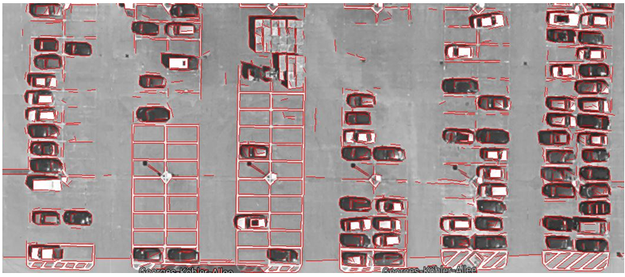
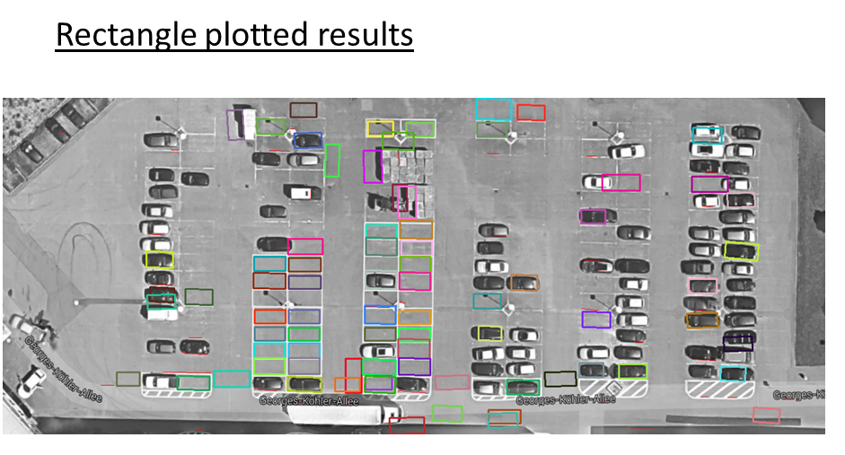
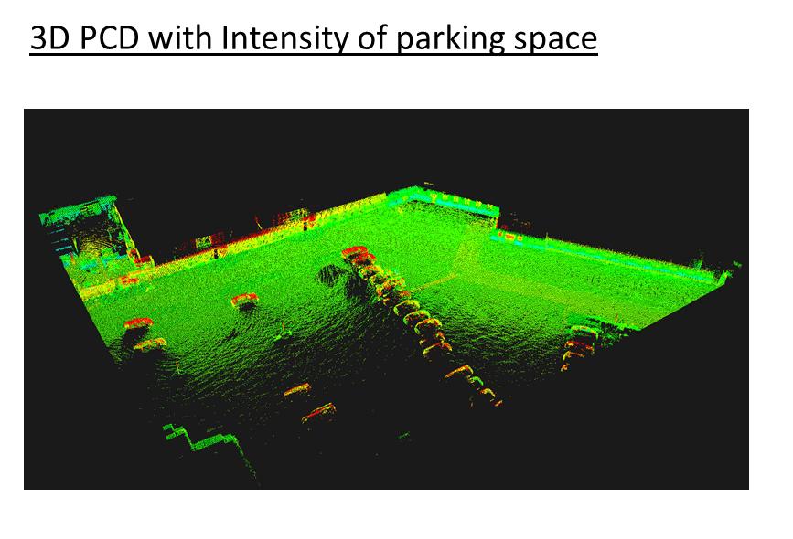
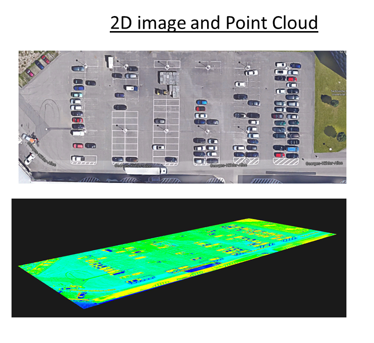
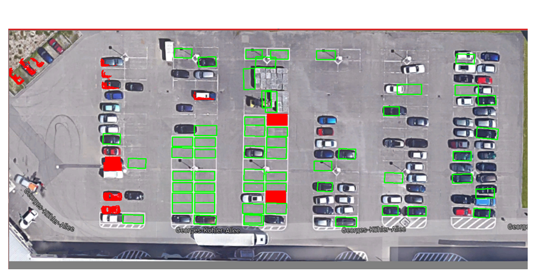
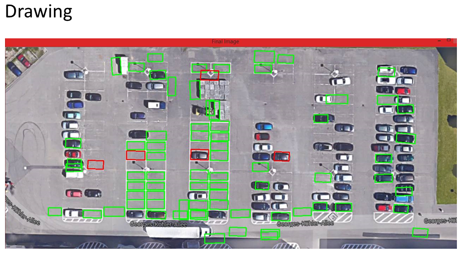

Parking Detection
===========================

This project is maintain no longer if you want to work or used it please [contact me](#contact). In order to get insight of this project check out the [presentation](http://www.slideshare.net/AmanullahTariq/parking-space-detect-70787242)

### Announcement: This project is not maintained anymore

## Quick summary
This is the code to detect the parking space for the car given 2D image from the google maps and 3D point Cloud data of the current enivornment.

## Purpose
This project was made for the purpose of the AIS LAB.

This repository contains:

- 2D Lane Detection
- 3D parking detection

## Results
* Initial data 2D image taking from the google image and plotting the lines using OpenCV

* Applying filters to enhance the lines of the parking spots

* 3D data of the parking area collected by laser sensors and then used using Point Cloud Library

* Converting 2D image to 3D space so later it can be combine with 3D data 

* Applying machine learning algorithm, linear regression to detect parking spots in 3D space and combining it with the 2D image data

* Enchancing result by Applying logistic regression

## Requiremnts
For this project to run you need:
* Visual Studio 2012
* OpenCV 3.0
* Point Cloud Library
